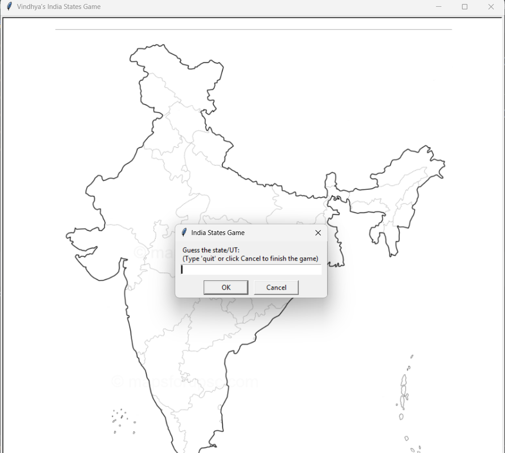
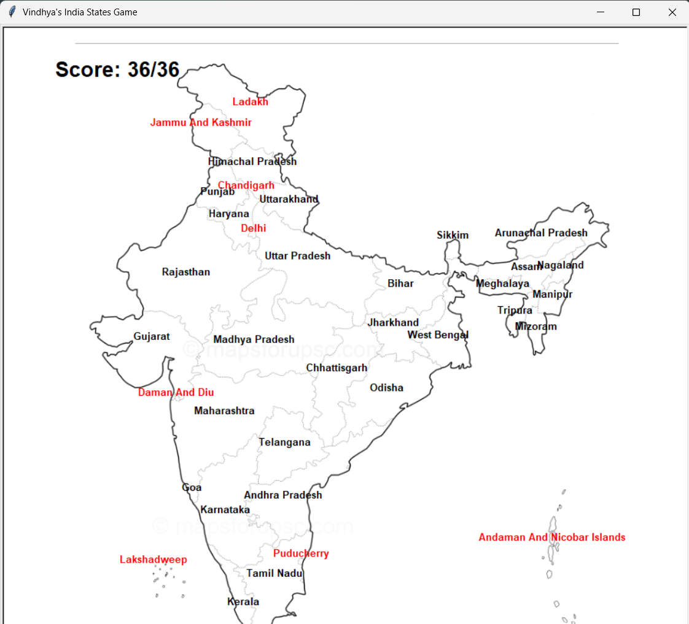

# Day 25 - India States Game
Author: Vindhya Hasini

🚀 Personal Enhancement Project

## Description
The India States Game is an interactive geography game inspired by the US States Game which was a part of Dr. Angela Yu's
100 Days of Code: The Complete Python Pro Bootcamp. Instead of guessing the 50 states of the USA, in this game, the user 
has to guess the 28 states and 8 union territories of India.

As the player correctly guesses a state/UT, its name is immediately displayed at its corresponding location on the India 
map. The game also keeps track of the player's score, prevents duplicate guesses, calculates final accuracy percentage
and displays names of states/UTs not guessed by the player.

This project was built as an independent implementation to reinforce Python fundamentals and related concepts while adapting
to an existing project idea.

## Files in this directory

| File/Folder Name                    | Description                                                                                                                                | Status      |
|-------------------------------------|--------------------------------------------------------------------------------------------------------------------------------------------|-------------|
| main.py                             | The file that contains the entire code for the game by integrating multiple objects from different classes                                 | ✅ Completed |
| scorecard.py                        | Contains class and method definitions for the scoreboard of the game                                                                       | ✅ Completed |
| turtle_writer.py                    | Contains class and method definitions for the turtle object that writes the names of states/UTs on the map                                 | ✅ Completed |
| game_assets                         | A folder that contains the map of India, game startup and end screenshots, and list of states/UTs with the x and y coordinates for the map | ✅ Completed |
| game_assets/coordinate_generator.py | A mini project that contains the code to get custom coordinates of user's click                                                            | ✅ Completed |

## Concepts Learned
* Object-Oriented-Programming (OOP)
* Working with the Turtle Graphics Module
* Reading CSV files using Pandas library
* Extracting and filtering data using DataFrames and Series
* Coordinate-based graphics and positioning
* Event-driven programming
* Lists and list operations
* String manipulation
* Conditionals and game loop
* Code modularization using Python classes

## Features
* Supports all 28 States and 8 Union Territories of India
* Displays each correctly guessed state/UT at its corresponding location on the map
* Union Territories are highlighted in red for better visual distinction
* Prevents duplicate guesses
* Multiple ways to exit the game (using the 'quit' keyword or Cancel button)
* Live score tracking
* Displays final score and accuracy percentage
* Lists all un-guessed states/UTs after quitting
* Clean and user-friendly terminal output
### Special Enhancement ⭐
* coordinate_generator.py -- a mini Python program that helps the user determine coordinates of their click on the Python 
Turtle Graphics window. In this particular project, this code helps get custom coordinates with the background as the India map

## Future Upgrades
* Export un-guessed states/UTs to a states_to_learn.csv file
* Add high score tracking
* Add timed game mode
* Support common abbreviations for state/UT names
* Add hints
* Add difficulty levels

## Key Takeaways
This project taught me that adapting an existing idea often requires much more thought than simply changing a few lines 
of code.

Although the game logic remained similar to the US States Game, creating the Indian version involved:
* Building a new dataset
* Designing a coordinate system for every state/UT
* Improving the overall user experience with additional features -- color coding for states and UTs, better coordinate system
to prevent crowding of state names in the northern region of the map
* Thinking about edge cases -- duplicate guesses, using the cancel button and invalid guesses
* Finding accurate positioning for the state/UT names on the map

## Challenges Faced
Despite reusing the game idea, this project helped me learn and practice multiple Python fundamental concepts, Pandas 
library concepts and Turtle Graphics concepts.

The biggest challenge that I faced was to find the coordinates for displaying the state/UT names on the Indian map. The
main reason this was highly challenging was because, the coordinates for the US states were provided as a part of course
content. However, I had to figure out the accurate coordinate system suitable for the Indian map independently.
To overcome this problem, I used AI to help myself come up with a mini project that gives me custom coordinates, whenever
I click on the screen, no matter what the background image is. Trying to come up with the code for this mini project was
a huge challenge in itself as it forced me to use Turtle Graphics fundamentals and combine them with terminal and on-screen
outputs.

Apart from making the mini project for the coordinate-system, finding accurate coordinates for each state/UT was another
challenge in itself. It helped me reinforce UI/UX thinking, and required a lot of debugging.
Positioning labels in the northern and north-eastern region of the map required accuracy to overcome excessive overlap.

Other minor challenges faced include:
* Updating the scorecard.py and turtle_writer.py files to format the output as required
* Preventing duplicate guesses
* Manipulating strings while checking user's guess and matching it alongside the actual state/UT name
* Maintaining multiple exit options for the game
* Maintaining a clean terminal output

## How to play?
1. Clone this repository
2. Make sure to clone the game_assets folder too
3. Run main.py
4. This is how the game start-up screen looks like:

5. Try to guess all the states and UTs of India!
6. Make sure to be very specific while naming the states/UTs. This project respects the official names for all states and
UTs. So, please make sure to type the names of some specific UTs as follows:
Andaman and Nicobar Islands, Daman and Diu (I chose this name for the UT of Daman and Diu, and Dadra and Nagar Haveli).
Plase note that the current version of the game is specific to correct spellings only. Accepting abbreviations and minor 
spelling errors are future upgrades.
7. Don't worry if you can't name all the states and UTs. Just exit the game and find out which states/UTs you missed out on!
8. On quitting the game, or completing it, you can view your final score and accuracy percentage along with the list of 
states/UTs you missed.
9. This is how the game end screen would look like if you guessed all the states/UTs correctly:

10. All states are displayed in 'black' while the union territories are displayed in 'red'.

## Note
This project is an original adaption of the US States Game from Dr. Angela Yu's 100 Days of Code: The Complete Python Pro 
Bootcamp. Rather than simply changing the map, I redesigned the project for India and included a mini project that can 
be used to code other geography games in the future. This project is an independent implementation and is not a part of
the course content.
